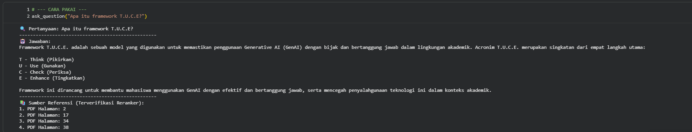

# 🤖 Advanced RAG System: Hybrid Search & Neural Re-ranking on Google Colab GPU T4

**Project Case Study: Academic Integrity & GenAI Guidelines (LSPR)**

## 📌 Pendahuluan

Proyek ini adalah implementasi sistem **Retrieval-Augmented Generation (RAG)** tingkat lanjut yang dijalankan di lingkungan Google Colab GPU T4. Proyek ini bertujuan untuk menciptakan asisten AI yang cerdas namun tetap disiplin pada sumber data tunggal (dokumen PDF akademik), guna memastikan setiap jawaban bersifat faktual dan dapat diverifikasi.

## 🌟 Mengapa Proyek Ini Penting?

Dalam perjalanan transisi karier saya ke Data Science, saya menemukan bahwa _vector search_ standar sering kali gagal menangkap detail teknis yang spesifik. Proyek ini menjawab tantangan tersebut dengan menggabungkan dua metode pencarian (**Hybrid**) dan memvalidasinya kembali dengan kecerdasan model kedua (**Reranker**).

## 🏗️ Arsitektur & Komponen Teknis

### 1. Model & Optimization

- **LLM:** `Llama-3.2-3B-Instruct`. Model terbaru yang sangat cerdas dalam instruksi.
- **Quantization (4-bit NF4):** Menggunakan `BitsAndBytesConfig` untuk memadatkan model sehingga hanya mengonsumsi sebagian kecil VRAM, namun tetap mempertahankan akurasi logika melalui presisi `bfloat16`.

### 2. Retrieval Strategy (Hybrid & Neural Rerank)

Sistem ini tidak hanya mengandalkan satu filter, melainkan menggunakan alur **Multi-Stage Retrieval**:

- **Hybrid Search:** Menggabungkan **BM25Retriever** untuk istilah kunci eksak (Keyword) dan **ChromaDB Vector Store** untuk makna semantik (Meaning).
- **Neural Re-ranking:** Menggunakan model `BAAI/bge-reranker-base` sebagai filter kualitas akhir. Dari 20 kandidat dokumen awal, sistem hanya meloloskan 5 dokumen paling relevan untuk dibaca oleh AI.

- **Hasil:** Jawaban yang dihasilkan jauh lebih presisi karena data yang masuk ke AI sudah disaring secara ketat oleh _Cross-Encoder_.

### 3. Orchestration & Pipeline

Dibangun menggunakan **LangChain Expression Language (LCEL)** untuk memastikan aliran data yang _seamless_:

- **BGE-M3 Embeddings:** Model embedding mutakhir yang mendukung representasi teks yang sangat kaya.
- **Contextual Compression:** Mekanisme cerdas yang mengintegrasikan _Reranker_ langsung ke dalam jalur pengambilan data.
- **Parent-Child Retrieval:** Digunakan untuk memastikan unit pencarian kecil tetap membawa konteks paragraf yang luas dari dokumen PDF.

## 🛠️ Langkah Implementasi (Step-by-Step)

### A. Pengaturan Lingkungan & Kuantisasi

Mengonfigurasi model Llama-3.2 menggunakan teknik _4-bit loading_ (`BitsAndBytesConfig`) agar sistem berjalan kencang tanpa kendala memori di infrastruktur GPU terbatas seperti Google Colab GPU T4.

### B. Pembuatan Prompt Template Disiplin

Menggunakan format instruksi Llama-3 untuk menetapkan batasan ketat agar model tidak berhalusinasi:

> _"Gunakan hanya informasi yang tersedia pada konteks... Jika jawaban tidak ditemukan, sampaikan dengan jujur bahwa Anda tidak mengetahui jawabannya."_

### C. Menjahit Rangkaian (Chain)

Menggunakan operator pipa (`|`) untuk menghubungkan `compression_retriever`, `prompt`, `llm`, dan `output_parser` dalam satu jalur eksekusi tunggal yang efisien.

## 📊 Analisis Output & Validasi

Sistem diuji dengan pertanyaan spesifik mengenai kebijakan akademik: _"Apa itu framework T.U.C.E?"_

**Analisis Jawaban:**

- **Sintesis Akurat:** Sistem berhasil mengekstrak dan menjelaskan poin _Think, Use, Check, Enhance_ dari Halaman 17 secara mendalam.
- **Verifikasi Referensi:** Berbeda dengan RAG biasa, sistem ini secara eksplisit mencantumkan nomor halaman sumber yang telah divalidasi oleh model Reranker untuk menjamin transparansi.

## 🚀 Kesimpulan & Pengembangan Kedepan

Proyek ini membuktikan bahwa penggabungan pencarian tradisional dan modern yang dipadukan dengan _Neural Reranking_ dapat menghasilkan sistem RAG yang jauh lebih tangguh. Pengembangan selanjutnya akan difokuskan pada integrasi _Memory_ agar asisten ini dapat diajak berdiskusi secara interaktif.

---

### 👨‍💻 Tentang Penulis

**Arief Wicaksono** _Mechanical Engineering Graduate (Universitas Darma Persada) | Data Science Student (Universitas Terbuka)_  
Berfokus pada transisi karier ke bidang AI & Machine Learning dengan spesialisasi pada Cloud Computing (AWS Certified) dan Generative AI.
